<<<<<<< HEAD
# Learning Management System (LMS)

## Overview

The Learning Management System (LMS) is a web application designed to facilitate online learning and course management. It provides a platform for educators to create and manage courses, while students can enroll in courses, complete content, and track their progress.

## Screenshots

### Landing Page
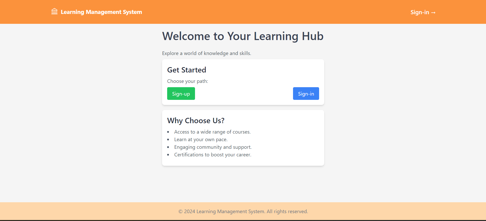

### Login Page
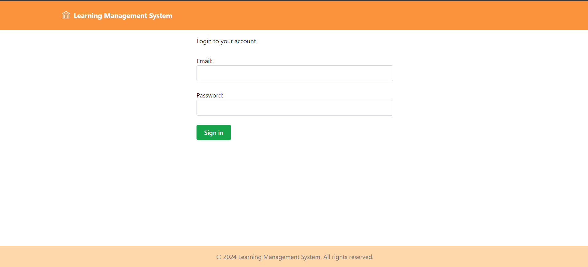

### Signup Page
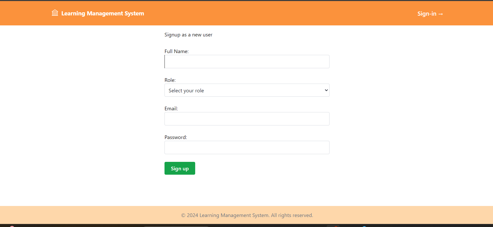

### Student Dashboard
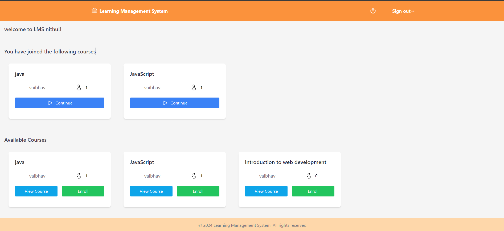

### View Course
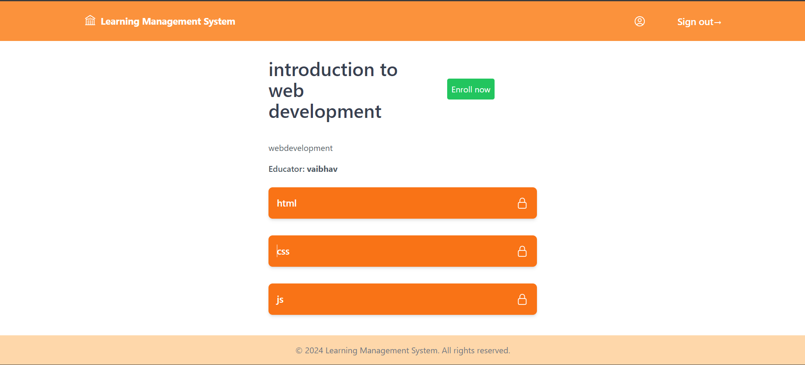

### Continue Course
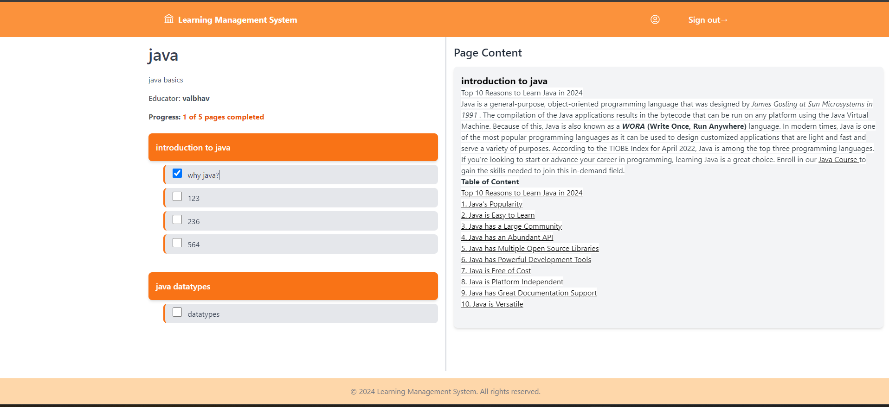

### Educator Dashboard
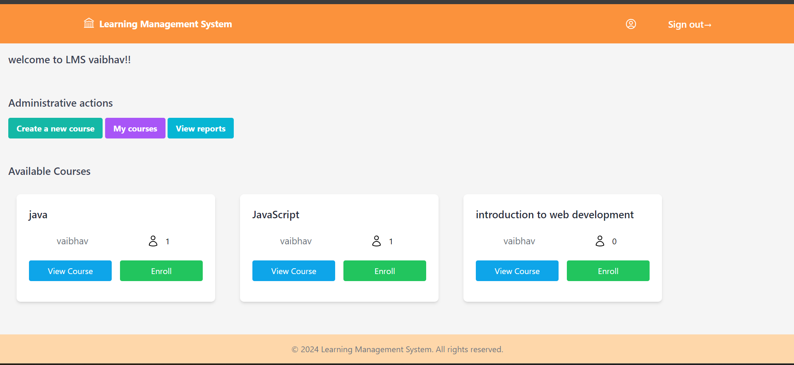

### Create Course
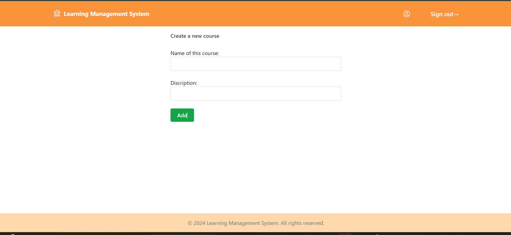

### Edit Course
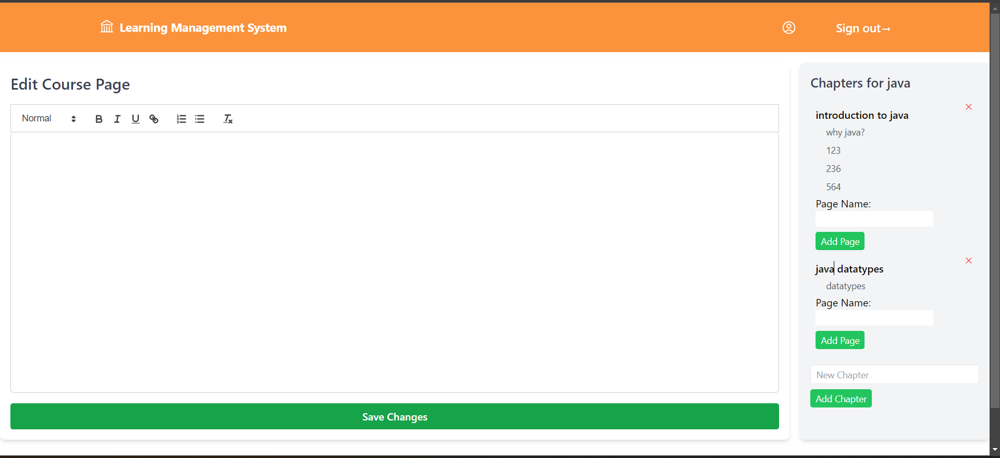

### Reports
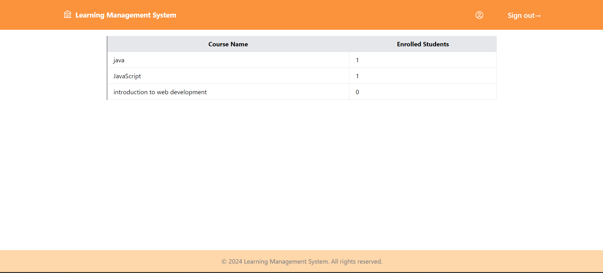

### Your Courses (Educator View)
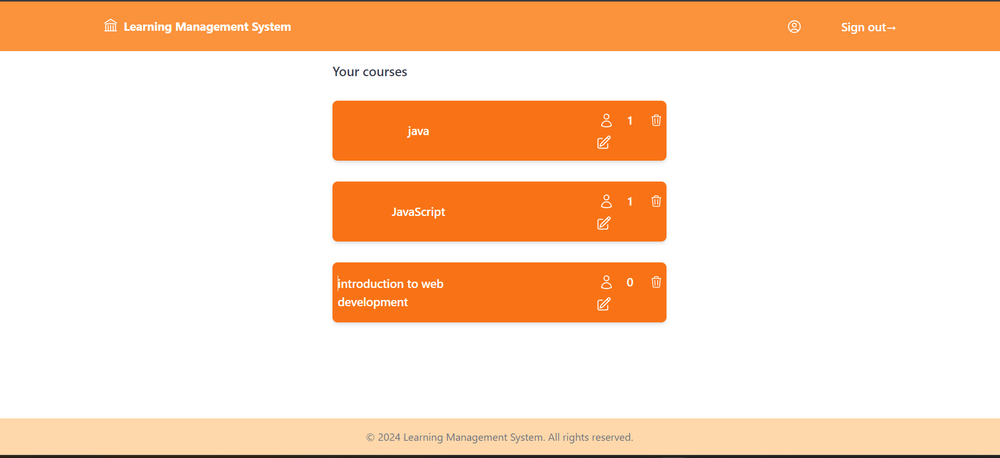

## Features

### Educator Role
- **Course Management**: 
  - Create, edit, and delete courses.
  - View all courses created by the educator.
- **Chapter Management**: 
  - Add and delete chapters within courses.
- **Page Management**: 
  - Add and delete pages within chapters.
- **Reporting**: 
  - View reports on all courses, including student enrollment data.

### Student Role
- **Course Enrollment**: 
  - Enroll in courses.
  - View course details without enrolling.
- **Page Completion**: 
  - Track learning progress by marking pages as complete.

### User Management
- Both students and educators can edit and delete their accounts.
- User details are accessible for both students and educators.
- A landing page is available for sign-in or sign-up.

## Technologies Used

- **Backend**: 
  - Node.js
  - Express.js
  - Sequelize (ORM for PostgreSQL)
- **Frontend**: 
  - EJS (Embedded JavaScript templating)
- **Authentication**: 
  - Passport.js (for local authentication)
- **Testing**: 
  - Jest
  - Supertest
  - Cheerio
- **Styling**: 
  - Tailwind CSS
- **Other Dependencies**: 
  - bcrypt (for password hashing)
  - connect-ensure-login (to protect routes)
  - connect-flash (for flash messages)
  - cookie-parser (for handling cookies)
  - tiny-csrf (for CSRF protection)

## Live Demo

You can access the live demo of the LMS [here](https://lms-4um5.onrender.com).

### Demo Video

Watch the demo video of the LMS [here](https://youtu.be/R06FCGwKsSg).

## Getting Started

### Prerequisites

- Node.js (version 14 or higher)
- PostgreSQL (version 12 or higher)

### Installation

1. Clone the repository:

   ```bash
   git clone https://github.com/HAMANPUREVAIBHAV/LMS.git
   cd LMS
   ```

2. Install dependencies:

   ```bash
   npm install
   ```

3. Set up the database:

   - Create a PostgreSQL database.
   - Update the database configuration in `config/config.json` (if applicable).
   - Run the following commands to set up the database:

   ```bash
   npx sequelize-cli db:create
   npx sequelize-cli db:migrate
   ```

4. Start the application:

   ```bash
   npm start
   ```

   For production mode:

   ```bash
   npm run start:prod
   ```

### Running Tests

To run tests, use the following command:

```bash
npm test
```

## Contributing

Contributions are welcome! Feel free to fork the repository and submit a pull request with your improvements.

## Author

- **HAMANPURE VAIBHAV**
=======
# LMS
>>>>>>> 527c9991327ca6668aec1f5c63ba682e583f640d
